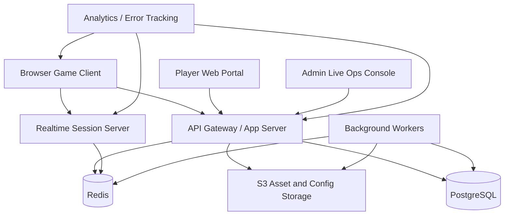

# MVP for a Web / Online SaaS Prototype

## Product Goal

Build a narrow but real online prototype that proves the game's core promise:

A human player and a bonded AI partner can enter a shared online world, fight together, grow together, and participate in limited live events with persistent account progression.

## MVP Scope

Keep the first release intentionally small.

### Content Scope

- 1 social hub city
- 2 mission zones
- 1 public world event
- 3 human weapon disciplines
- 3 AI classes
- 3 elemental attunements
- 1 narrative arc introducing the first major AI civilization
- 2 to 4 player co-op instances

### Systems Scope

- account creation and login
- player profile and cloud save
- human loadout management
- AI partner roster and progression
- bond progression and combo unlocks
- matchmaking or friend invite flow
- mission instancing
- basic social hub presence
- event rotation scheduler
- telemetry and balancing dashboards

## Recommended Product Shape

The practical SaaS form is not "MMO on day one." It is a service-based game platform with three surfaces:

1. Player Game Client: gameplay, progression, inventory, co-op, event participation
2. Player Web Portal: account management, AI roster review, patch notes, live ops calendar
3. Admin / Live Ops Console: event scheduling, content flags, tuning values, analytics review

## Recommended Tech Stack

For a fast and credible web-first MVP:

### Frontend

- Next.js with TypeScript for portal, account flows, and shared UI shell
- Babylon.js for a browser-playable 3D prototype layer
- Tailwind CSS or CSS modules for product UI
- Zustand for lightweight client state

### Realtime / Multiplayer

- Colyseus on Node.js for room-based multiplayer sessions
- WebSocket transport for synchronized combat and co-op state
- Redis for presence, room metadata, and short-lived coordination state

### Backend APIs

- NestJS or Next.js route handlers for authenticated game services
- REST for account, inventory, and progression APIs
- background workers for event rotation, rewards, and telemetry processing

### Data Layer

- PostgreSQL for durable player, inventory, progression, and event records
- Prisma ORM for typed schema management
- S3-compatible blob storage for assets, logs, and content manifests

### Identity and Payments

- Clerk or Auth0 for auth and account flows
- Stripe only if monetization is enabled early

### Observability

- PostHog for product analytics and event funnels
- Sentry for client and server error tracking
- OpenTelemetry for service tracing if the stack grows beyond MVP

### Deployment

- Vercel for web frontend and portal
- Fly.io or Render for realtime servers and background workers
- Neon, Supabase, or managed PostgreSQL for database hosting
- Upstash or managed Redis for lightweight ops

## Why This Stack Fits

This stack is strong for an early product because it:

- supports browser access without requiring launcher friction
- keeps the team on a mostly TypeScript stack
- separates realtime combat sessions from slower account APIs
- can scale from prototype to early live service without a rewrite

## Core Service Boundaries

### 1. Identity Service

Responsibilities:
- auth
- sessions
- player profile creation
- account recovery

### 2. Player Progression Service

Responsibilities:
- human level
- AI Instance state
- bond resonance
- inventory and unlocks

### 3. Match / Session Service

Responsibilities:
- party creation
- invites
- room allocation
- session lifecycle

### 4. Live Event Service

Responsibilities:
- event schedule
- zone modifiers
- participation rewards
- regional faction state

### 5. Content Configuration Service

Responsibilities:
- weapon tuning
- drop tables
- AI class values
- event parameters
- live balancing without full redeploys

## Suggested Domain Model

### Core Tables

- users
- player_profiles
- human_loadouts
- ai_instances
- ai_modules
- bond_states
- player_inventories
- factions
- missions
- session_runs
- live_events
- event_participation
- rewards

## High-Level Architecture

## MVP Gameplay Flow

1. Player creates an account and enters the hub city.
2. Player chooses a starter human loadout and bonds with a starter AI Instance.
3. Player runs a short guided mission to learn combat and bond actions.
4. Player unlocks one elemental attunement and one AI specialization choice.
5. Player joins a co-op mission or public event.
6. Rewards update the human tree, AI tree, and bond tree.
7. The player returns to the hub, modifies build choices, and prepares for the next cycle.

## Vertical Slice Definition

A solid vertical slice should prove the following:

- one complete mission loop from hub to combat to rewards
- one AI partner class with visible evolution
- one bond combo system that feels better than solo combat
- one live event that changes player priorities for a limited time
- one co-op session that is stable for at least four concurrent players in test

## Delivery Roadmap

### Phase 1: Design Lock

- finalize classes, elements, and first-faction fiction
- define data schema and balancing variables
- produce UI wireframes for hub, loadout, and mission queue

### Phase 2: Prototype Core Loop

- build movement and combat prototype
- integrate one AI companion behavior tree
- stand up auth, profile, and save flow
- run solo mission end-to-end

### Phase 3: Online Layer

- add session server
- add party flow
- synchronize combat essentials
- test event scheduler and cloud persistence

### Phase 4: Live Ops MVP

- enable rotating event modifiers
- add telemetry dashboards
- test balancing changes through remote config

## Key Risks

1. Browser 3D performance may constrain visual ambition.
2. Realtime sync can overwhelm the team if combat complexity is too high too early.
3. Live-service scope can balloon if seasonal systems are designed before the first fun combat loop exists.

## Scope Discipline Rules

1. Prove human + AI bond first.
2. Keep the first world small and replayable.
3. Prefer one great event over five shallow activities.
4. Delay large-scale open world and full MMO features.
5. Keep the architecture modular, but avoid premature microservices.
